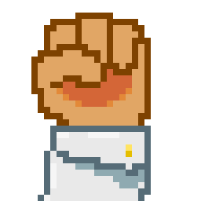

<p>
  
</p>

# Don't Punch My TACZ

<p>
  
  
  
  
</p>

Punchy is great. Punchy holding a TACZ gun is two guns. Yeah.

The Punchy guy already told us the fix: press **F8**, blacklist the guns. That works. This jar just does the click so your players don't have to.

Not official. Not made by Punchy or TACZ. Just a tiny helper.

## Install

Drop it in `mods`.

Everyone who plays needs it. The server does not.

You need:

- Minecraft **1.21.1**
- **NeoForge**
- **Punchy**

Nice to have (it only touches these if you actually installed them):

- **TACZ** > all guns
- **Create** > potato cannon, extendo grip, worldshaper
- **Create Simulated** (Aeronautics) > plunger launcher
- **Power Grid** > portable saw, drill, electrozapper

## What it does

It adds those items to Punchy's F8 blacklist. Your other Punchy settings stay put

## Build

GitHub builds it when you push. Or on your machine, Java 21:

```bash
./gradlew build
```

Jar lands in `build/libs/`.

## License

MIT. Go wild.
